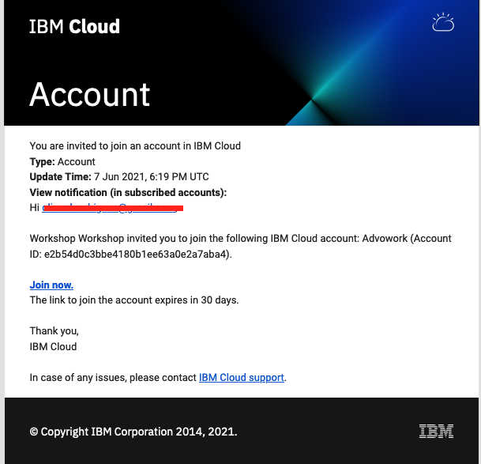
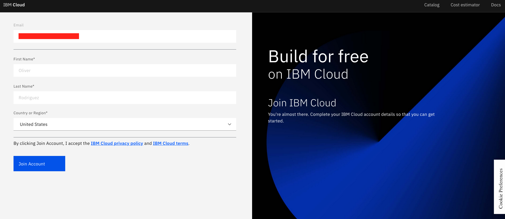

# Grant Cluster

## IBM Kubernetes Service (IKS) and RedHat OpenShift Kubernetes Service (ROKS)

The `grant cluster` method to get access to a Kubernetes cluster will assign access permissions to a cluster or namespace in a cluster that was created prior to the request. Creating a cluster and provisioning the VMs and other resources and deploying the tools may take up to 15 minutes and longer if queued. Permissioning access to an existing cluster in contrast happens in 1 or 2 minutes depending on the number of concurrent requests.

You need an IBM Cloud account to access your cluster,

1. If you do not have an IBM Cloud account yet, register at [https://cloud.ibm.com/registration](https://cloud.ibm.com/registration),
2. Or find instructions to create a new IBM Cloud account [here](NEWACCOUNT.md),

To grant a cluster,

1. You need to be given a URL to submit your grant cluster request,
1. Open the URL to grant a cluster, e.g. `https://<workshop>.mybluemix.net`,
1. The grant cluster URL should open the following page,

    

1. Complete the form using the `lab key` given to you by the instructor and your IBM Id to access your IBM Cloud account.

1. Before you can access the new account, you will need to accept the invitation that was sent to your email. In a new tab, log in to your email that you used to sign up for IBM Cloud and look for an email from IBM Cloud [no-reply@cloud.ibm.com] and click on `Join Now`

    

1. You should then be taken to a new page that has a form with prefilled information from your IBM Cloud account. Ensure that the information is correct and then click on the `Join Account` button.

    

1. You can then go back to the success page of the grant-cluster application and follow the instructions to log into the IBM Cloud account.

1. Instructions will ask to `Log in to this IBM Cloud account`

    

1. When you click the link to log in to the IBM Cloud account, the IBM Cloud overview page will load with an overview of all resources on the account. In the top right, you will see an active account listed. The active account should be the account on which the cluster is created, which is not your personal account. Click the account dropdown if you need to change the active account.
1. Navigate to Clusters,
1. And select the cluster assigned to you...

    

1. Details for your cluster will load,
1. Go to the `Access` menu item in the left navigation column,
1. Follow the instructions to access your cluster from the client,

    

1. Optionally, you can use the IBM Cloud Shell at [https://shell.cloud.ibm.com/](https://shell.cloud.ibm.com/) to check access. The cloud shell is attached to your IBM Id. It might take a few moments to create the instance and a new session,

    
