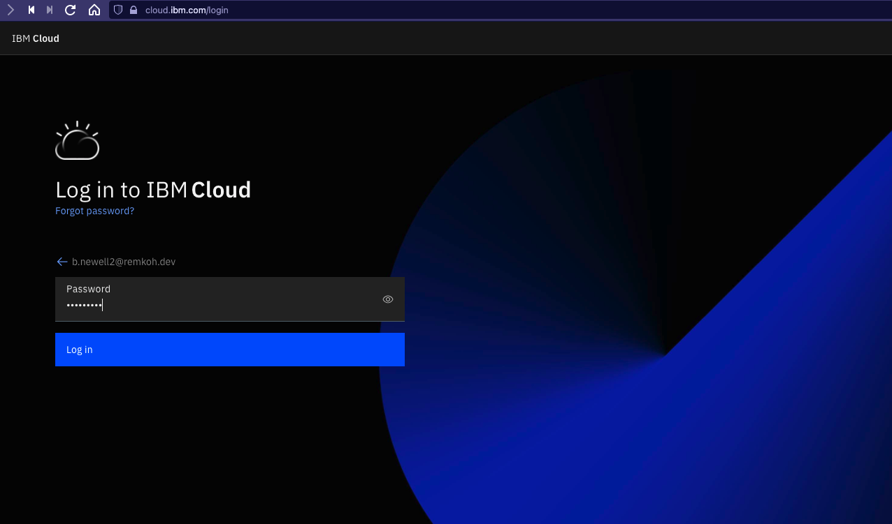
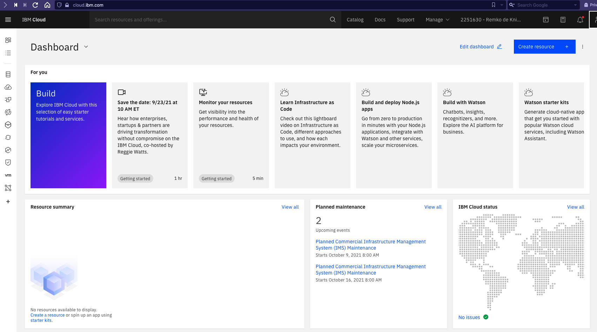

# Log into IBM Cloud Account

If you already have an existing IBM Cloud account, follow the instructions below to log into your IBM Cloud account. To register for a new IBM Cloud account, go [here](NEWACCOUNT.md).

1. Open a web browser to open the IBM Cloud console at [https://cloud.ibm.com/login](https://cloud.ibm.com/login).
1. When prompted, enter your IBM Id (the email ID you used to create the account above) followed by your password to login.

    

1. Click `Continue`,
1. When prompted for your password, enter your password,

    

1. Click `Log in`,
1. When successfully authenticated, the IBM Cloud Dashboard will load,

    
