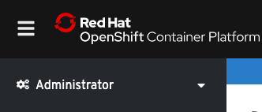
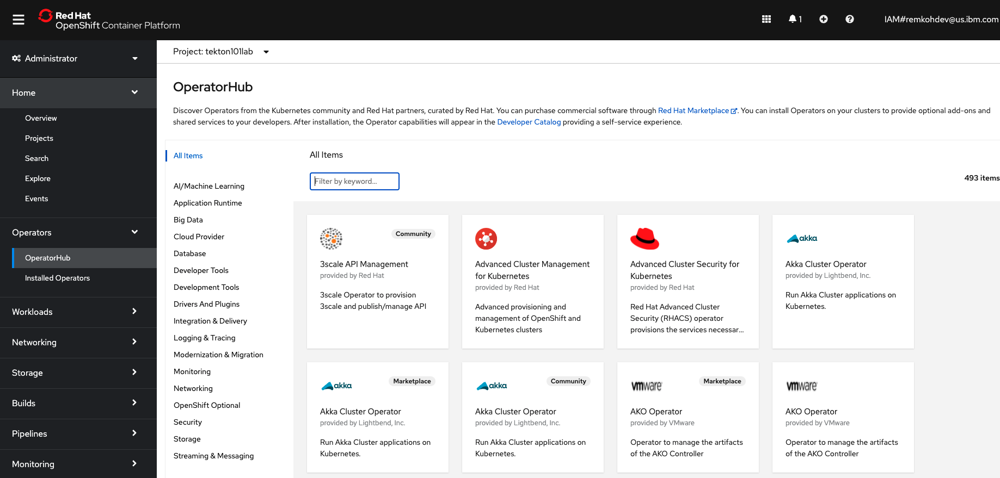
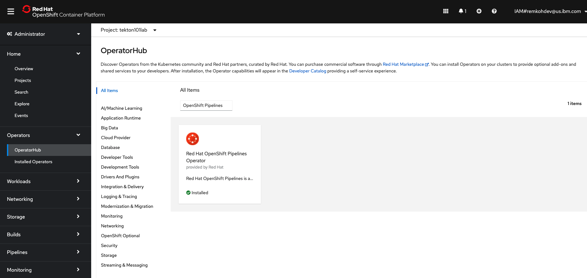
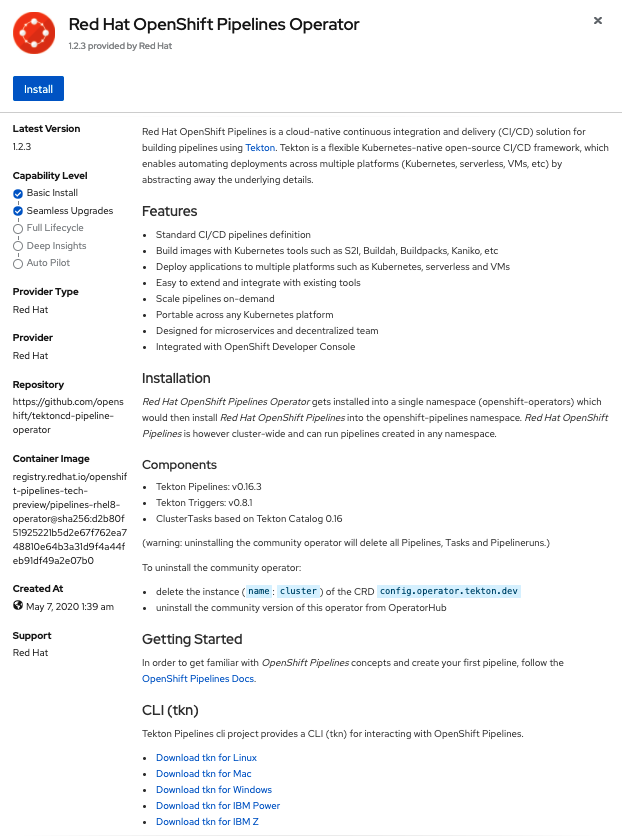
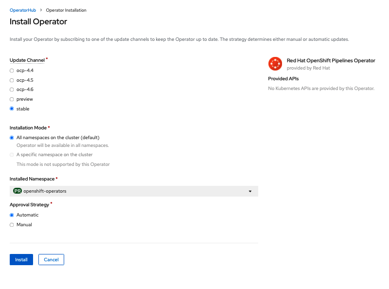
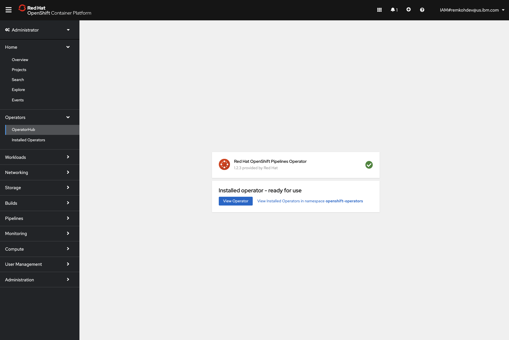
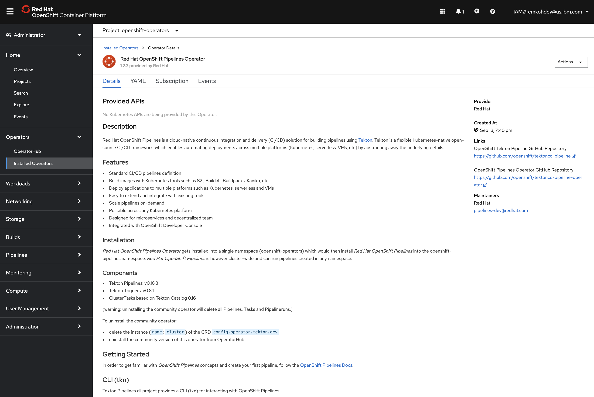
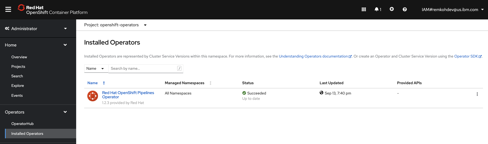
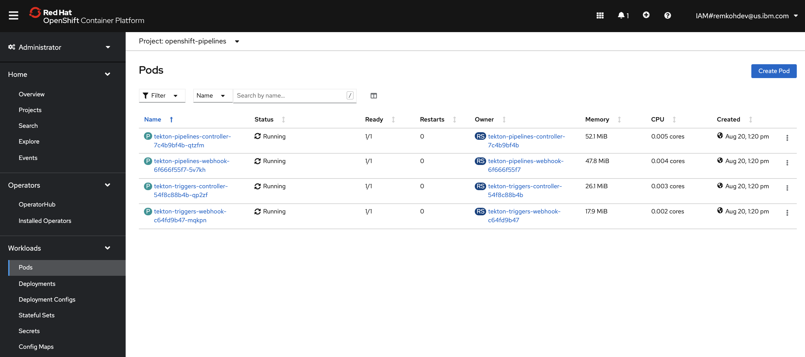

# Install Red Hat OpenShift Pipelines Operator

OpenShift Pipelines is provided as an add-on on top of OpenShift that can be installed via an operator that is available in the OpenShift OperatorHub.

To start, make sure you are on the **Administrator** perspective as shown below:

Go to **Operators > OperatorHub** in the Web Console. You can see the list of available operators for OpenShift provided by Red Hat as well as a community of partners and open-source projects.

In the search bar where it says `Filter by keyword...`, type OpenShift Pipelines to find the **Red Hat OpenShift Pipelines Operator**:

Click on **Red Hat OpenShift Pipelines Operator**, and then **Install**:

Leave the default settings and click on **Install** in order to subscribe to the installation and update channels:

After clicking **Install**, you will be taken to the **Installed Operators** page. 

Wait until the **Red Hat OpenShift Pipelines Operator** finishes installation. Click **View Operator**,

Or go to **Operators > Installed Operators** in the web console,

That's all. The operator has installed OpenShift Pipelines on the cluster.

To confirm the installation, go to **Workloads > Pods** and check for tekton-pipelines and tekton-triggers pods with `Running` state in the `openshift-pipelines` namespace. If so, openshift-pipelines has been successfully installed on your cluster.

Note: this is an updated version for ROKS based on [Install OpenShift Pipelines](https://github.com/openshift/pipelines-tutorial/blob/master/install-operator.md) by OpenShift.
