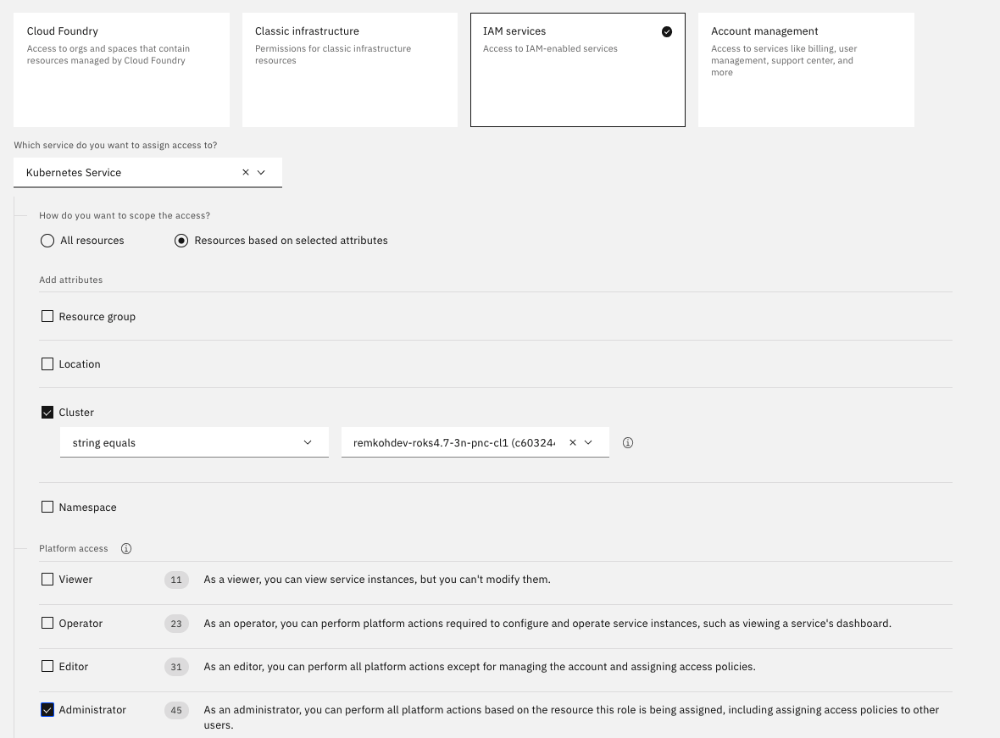
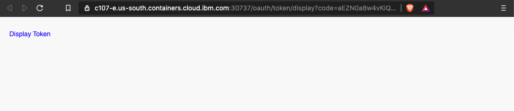
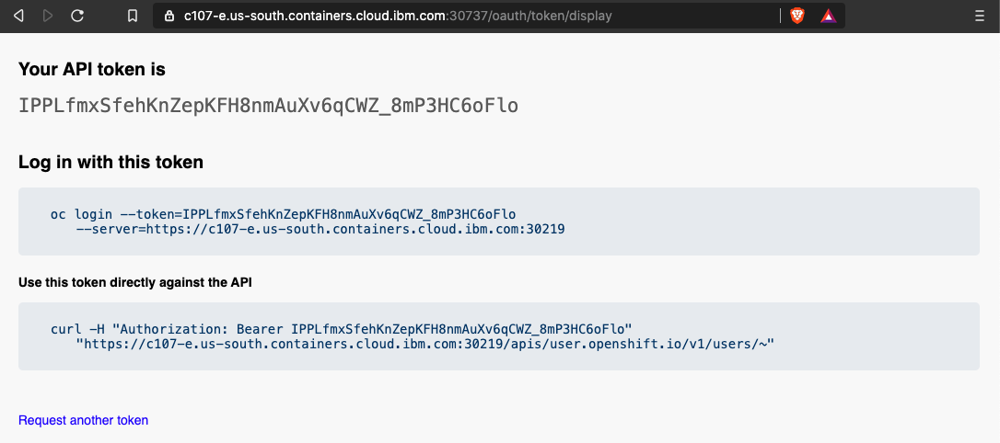
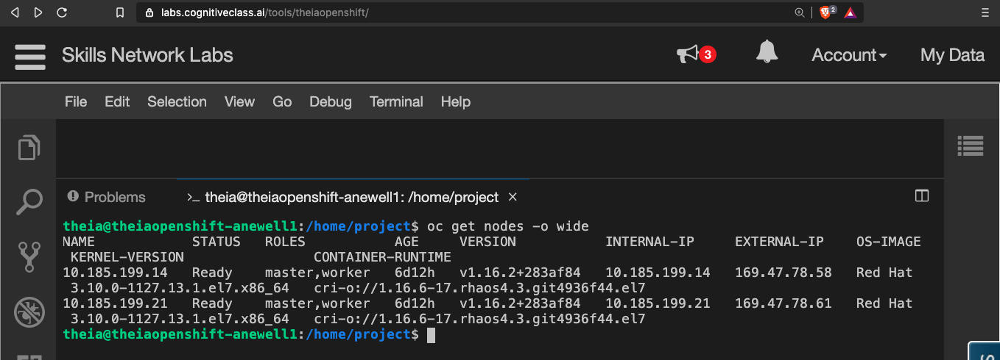

# Connect to RedHat OpenShift Kubernetes Service (ROKS)

There are several manners to log into your OpenShift cluster on IBM Cloud. For a complete overview see [Accessing OpenShift clusters](https://cloud.ibm.com/docs/openshift?topic=openshift-access_cluster).

## Shell

Most of the labs are run using CLI commands.

The IBM Cloud Shell available at [https://shell.cloud.ibm.com](https://shell.cloud.ibm.com) is preconfigured with the full IBM Cloud CLI and tons of plug-ins and tools that you can use to manage apps, resources, and infrastructure.

## Login to IBM Cloud

Login to IBM Cloud via the UI,

1. Go to [https://cloud.ibm.com](https://cloud.ibm.com) in your browser and login.

1. Make sure that you are in the correct account#.

    

>Note: you may not have access to your OpenShift cluster if you are not in the right account#.

Login via the CLI,

1. Login,

```bash
ibmcloud login [-sso]
```

1. if you know the region in which your cluster is located, target the appropriate region, and target a non-default resource-group,

```bash
ibmcloud regions
ibmcloud resource groups
export REGION=<region>
export RESOURCE_GROUP=<resource-group>
ibmcloud target -r $REGION -g $RESOURCE_GROUP
```

## Check your Cluster Status

```bash
export CLUSTER_NAME=<cluster_name>
ibmcloud oc cluster get -c $CLUSTER_NAME
```

## Login to OpenShift with an API Key

```bash
export IBMCLOUD_APIKEY_NAME=<username_roks_apikey>
ibmcloud iam api-key-create $IBMCLOUD_APIKEY_NAME
export IBMCLOUD_APIKEY=<copy_apikey_value>
ibmcloud login --apikey $IBMCLOUD_APIKEY
ibmcloud target -r $REGION -g $RESOURCE_GROUP

ibmcloud oc cluster config -c $CLUSTER_NAME [--endpoint private]
ibmcloud oc cluster get -c $CLUSTER_NAME
oc login -u apikey -p $IBMCLOUD_APIKEY [--server=<private_service_endpoint>]
```

## Login to OpenShift as Admin

Make sure that you have the Administrator platform access role for the cluster.

Go to Manage > Access (IAM), in `My user details` or selected user details, go to Access Policies > click Assign access,



From the CLI, you can now login to your cluster using the `--admin` flag,

```bash
ibmcloud oc cluster config -c $CLUSTER_NAME --admin
```

## Login to OpenShift with an API Token

1. In a new browser tab, go to [https://cloud.ibm.com/kubernetes/clusters?platformType=openshift](https://cloud.ibm.com/kubernetes/clusters?platformType=openshift).

1. Make sure the account holding the cluster is selected,

1. Select your cluster instance and open it.

1. Click `OpenShift web console` button on the top.

    

1. Click on your username in the upper right and select `Copy Login Command` option.

    

1. Click the `Display Token` link.

    

1. Copy the contents of the field `Log in with this token` to the clipboard. It provides a login command with a valid token for your username.

    

1. Go to the your shell terminal.

1. Paste the `oc login command` in the IBM Cloud Shell terminal and run it.

1. Verify you connect to the right cluster.

    ```console
    oc get all
    oc get nodes -o wide
    ```

    

1. Optionally, for convenience, set an environment variable for your cluster name.

    ```console
    export CLUSTER_NAME=<your_cluster_name>
    ```
