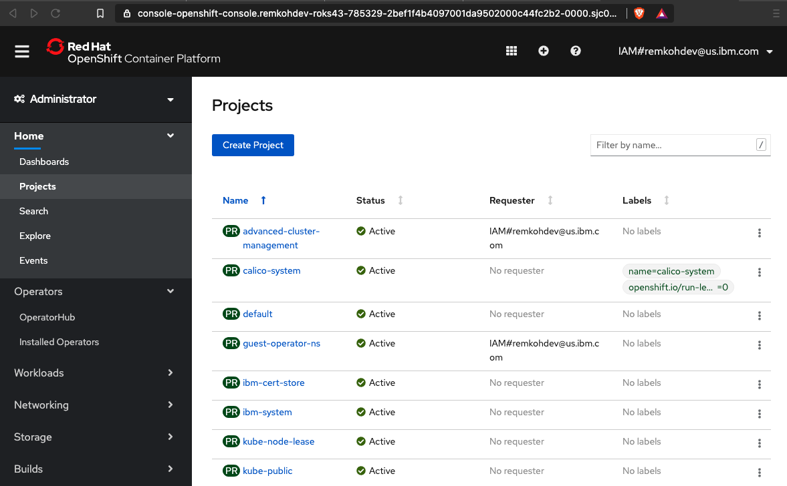
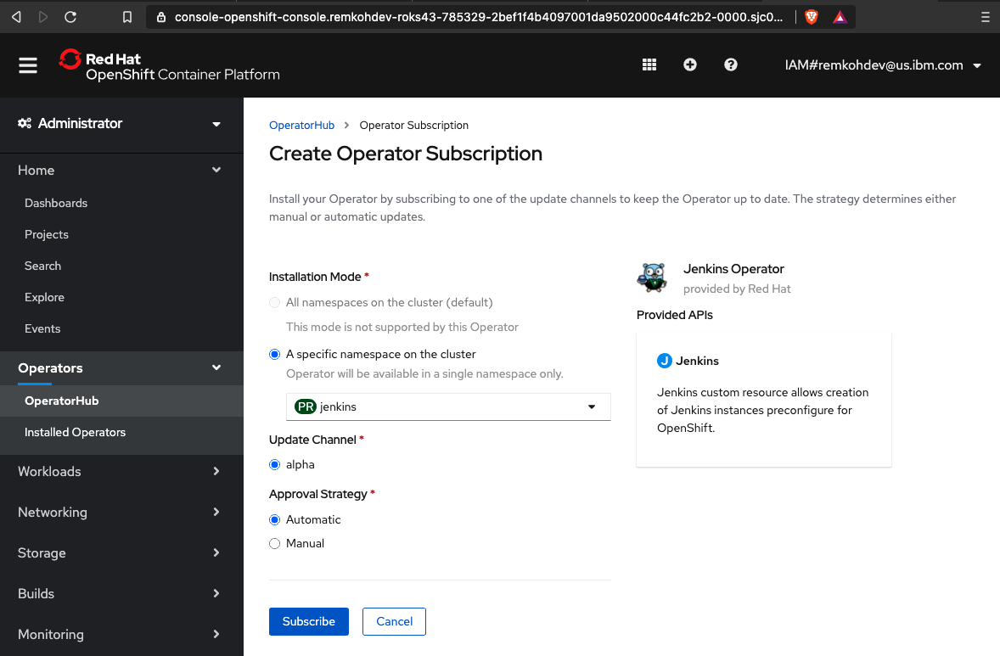
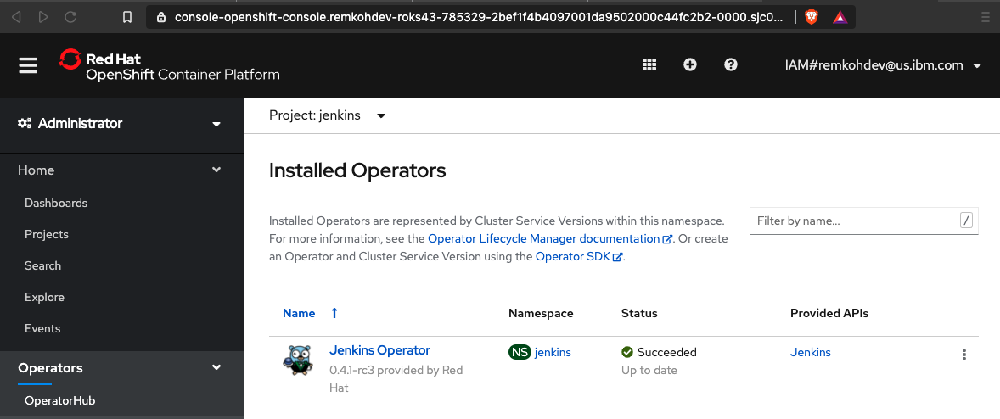
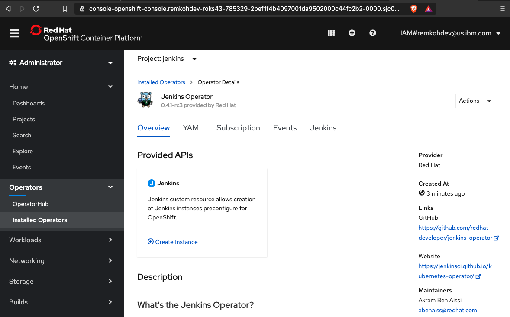
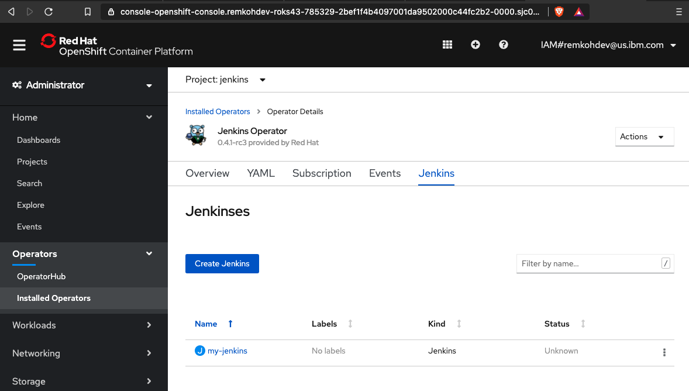
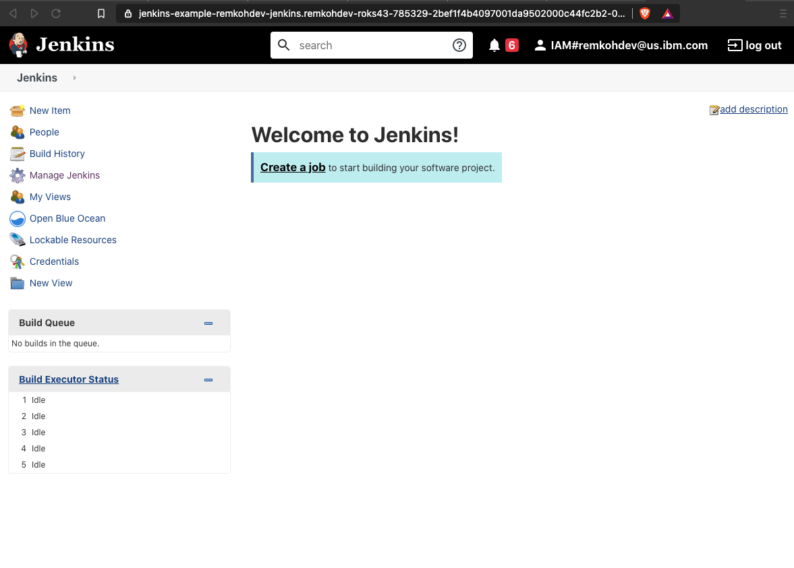

# Setup Jenkins on OpenShift 4.3

Pre-requirements:
- OpenShift 4.3 cluster

1. From the IBM Cloud cluster dashboard, click the `OpenShift web console` button,

    

2. First we need to create a new project named `jenkins` to deploy the Jenkins service to,

3.  From the terminal,

    ```
    oc new-project jenkins
    ```

    outputs,
    
    ```
    $ oc new-project jenkins
    Now using project "jenkins" on server "https://c107-e.us-south.containers.cloud.ibm.com:31608".
    ```

4. Or in the Openshift web console, go to `Home` > `Projects`,
5. Click `Create Project`

    

6. For `Name` enter `jenkins`, for `Display Name` enter `jenkins`, and for `Description` enter `jenkins`,

    

7. Click `Create`,
8. Go to `Operators` > `OperatorHub`,
9.  For `Filter by keyword` enter `Jenkins`,

    

10. Select the `Jenkins Operator` by `Community`, `provided by Red Hat`,
11. Click `Continue` to `Show Community Operator`,

    

12. Review the operator information, and click `Install`,

    

13. In the `Create Operator Subscription` window, choose `A specific namespace in the cluster` and select the project `jenkins`, select `alpha` under `Update Channel`, select `Automatic` under `Approval Strategy`,

    

14. Click `Subscribe`,
15. The `Installed Operators` page will load, wait until the `Jenkins Operator` has a `Status` of `Succeeded`,

    

16. Click the installed operator linked `Name` of `Jenkins Operator`,

    

17. In the `Provided APIs` section, click the `Create Instance` link in the `Jenkins` panel,
18. In the `Create Jenkins` YAML definition for the new Jenkins instance, change the `metadata.name` to `my-jenkins`, accept all other specifications,

    

19. Click `Create`,

    

20. Go to `Networking` > `Routes`, and look for a new Route `jenkins-my-jenkins`,

    

21. Click the link for `jenkins-my-jenkins` route in the `Location` column,

    

22. A route to your Jenkins instance opens in a new browser window or tab,
23. Click `Log in with OpenShift`,

    

25. Welcome to Jenkins !

    

26. Configure Jenkins
    1. Go to Jenkins > Manage Jenkins > Global Tool Configuration,
    2. Go to the `Maven` section, 
    3. Click `Maven Installations`,
    4. If no Maven installer is configured, click `Add Maven`,
    5. Configure the `Name` to be `maven`, check the option `Install automatically` and select version `3.6.3`,
    6. Click Save,

    
