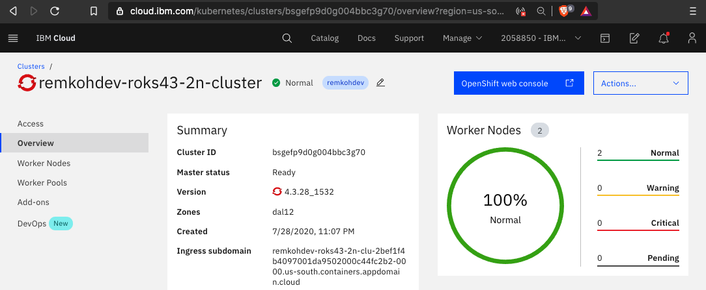

# RedHat OpenShift Kubernetes Service (ROKS)

## Login to IBM Cloud

To login to IBM Cloud,

1. Go to https://cloud.ibm.com in your browser and login.

1. Make sure that you are in the correct account#.

    

>Note: you may not have access to your OpenShift cluster if you are not in the right account#.

## Shell

Most of the labs are run using CLI commands. 

The IBM Cloud Shell available at https://shell.cloud.ibm.com is preconfigured with the full IBM Cloud CLI and tons of plug-ins and tools that you can use to manage apps, resources, and infrastructure. 

Another great online shell is available via the `Theia - Cloud IDE (With OpenShift)` at https://labs.cognitiveclass.ai. The Cognitive Class shell comes with a Docker Engine and Helm v3 at the time of writing.

## Connect to RedHat OpenShift Kubernetes Service (ROKS)

1. In a new browser tab, go to https://cloud.ibm.com/kubernetes/clusters?platformType=openshift.

1. Make sure the account holding the cluster is selected,

1. Select your cluster instance and open it.

1. Click `OpenShift web console` button on the top.

    

1. Click on your username in the upper right and select `Copy Login Command` option.

    

1. Click the `Display Token` link.

    

1. Copy the contents of the field `Log in with this token` to the clipboard. It provides a login command with a valid token for your username.

    

1. Go to the your shell terminal.

1. Paste the `oc login command` in the IBM Cloud Shell terminal and run it.

1. Verify you connect to the right cluster.

   ```shell
   oc get all
   oc get nodes -o wide
   ```

    

1. Optionally, for convenience, set an environment variable for your cluster name.

   ```shell
   export CLUSTER_NAME=<your_cluster_name>
   ```